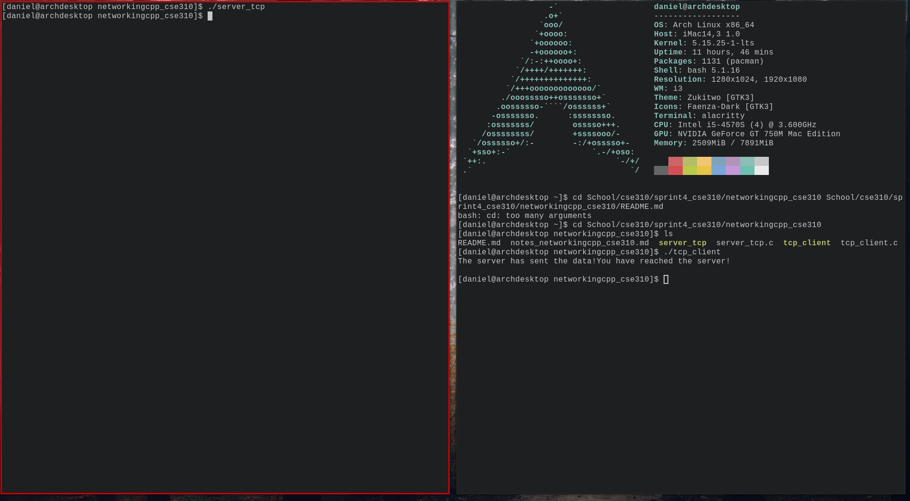

# Overview

This client-server tcp connection is used by executing both binaries which represent a client and server respectively. Structures are used to hold the port number and ip addresses. Sockets are created, and after both programs are executed (This can be done using seperate terminals), they will connect.  

I wrote this program to get a clearer understanding of the backend of networking. When I eventually start to create my own servers an applications that require them, I would use this program as a foundation to establish a connection between a client and server. That way, it's easier to debug and customize, hence I chose C!  

  

[Demonstration: Networking in C](https://youtu.be/NmL78i3G03w)  
# Network Communication

The architecture that I demonstrated in my code is a Client-Server model. I noticed that there were tutorials and sources readily available to do socket programming in python, but as an embedded systems enthusiast, I really wanted to challenge myself and learn thouroughly by choosing to do this in C.

Port number used: 9002  

When connection is successful, the server will send a char message "You have reached the server!" to the client. The client-side will display that sent message!   

# Development Environment

All code was written using 'DOOM Emacs', a layering of Emacs with Vim-based keybindings. Code compiled using GCC in Linux. Go FOSS! :)  

Libraries:  
Netinet (C)  

# Useful Websites

* [Socket Programming](https://www.geeksforgeeks.org/socket-programming-cc/)

# Future Work

* send more than just a message!  
* work on making sure this will work under different wifi or OS's.  
* **Create a bbs!**  
